校园兼职平台
===============

1.  校园兼职平台服务端 jianzhi-server https://github.com/zzhougy/jianzhi-server.git
2.  校园兼职平台门户端 jianzhi-portal https://github.com/zzhougy/jianzhi-portal.git
3.  校园兼职平台聊天端 jianzhi-webim https://github.com/zzhougy/jianzhi-webim.git
4.  校园兼职平台后台端 jianzhi-manage-web https://github.com/zzhougy/jianzhi-manage-web.git

项目介绍
-----------------------------------
本系统用户分为三类：后台管理员（超级管理员，普通管理员），求职者（学生），
招聘人员（负责人、普通招聘人员）。本系统主要分为前台和后台，前台面向的是所有用
户，后台面向的是系统管理员，可以对网站信息及用户数据进行管理。

前台实现的模块功能需求：
1) 用户进行账号的登录、注册
2) 用户按关键词、条件搜索岗位和企业，浏览岗位和企业的详细信息
3) 求职者可以对自己个人基本信息进行查看和编辑，进行简历投递，查看简历投递记录和进度
4) 招聘单位对个人账号信息查看和编辑，发布和编辑岗位信息，查看收到的简历。企业负责人对企业信息的编辑及审核信息提交
5) 即时通讯，求职者与招聘人员进行私聊
6) 用户可以对求职者或招聘单位进行评价、投诉

后台实现的模块功能需求：
1) 管理员查看、编辑求职者和招聘单位人员基本信息，对招聘单位提交的企业信息进行审核
2) 管理员可以查看、编辑招聘单位发布的兼职信息
3) 管理员对违规的账号或招聘单位进行封禁处理
4) 超级管理员能够管理平台所有用户的角色及角色所拥有的权限

技术架构：
-----------------------------------

#### 后端

- IDE建议：IDEA
- 语言：Java 8+
- 依赖管理：Maven
- 基础框架：Spring Boot
- 持久层框架：MybatisPlus
- 代码生成器：mybatis-plus-generator
- 安全框架：Apache Shiro，Jwt
- 数据库：MySQL5.7+，阿里云OSS
- 数据库连接池：阿里巴巴Druid
- 日志打印：logback
- 缓存：Redis
- 其他：RabbitMQ，Netty，websocket，fastjson，Swagger-ui，lombok等。

#### 前端

- IDE建议：WebStorm、Vscode
- 技术栈：Vue2.0 + element-ui
- 依赖管理：node14+，npm

运行效果
-----------------------------------

### 门户端
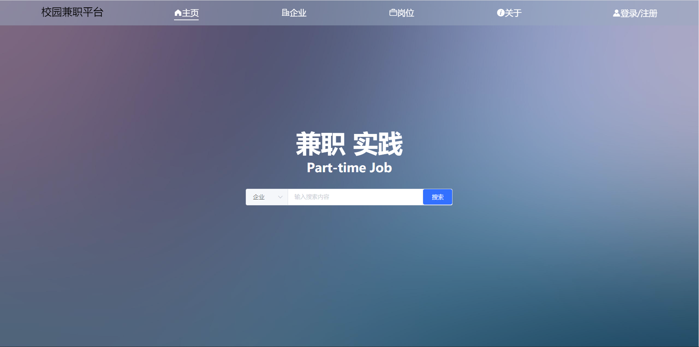
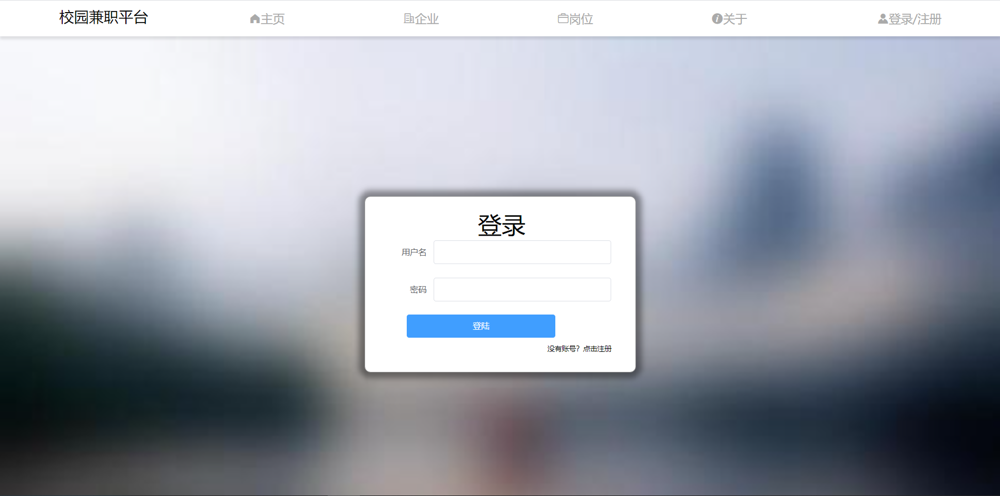
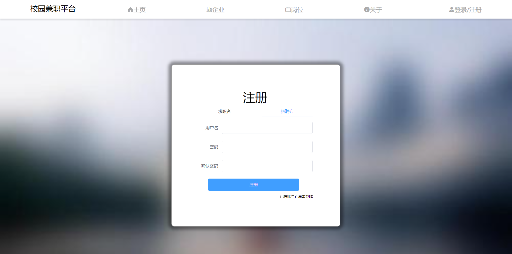

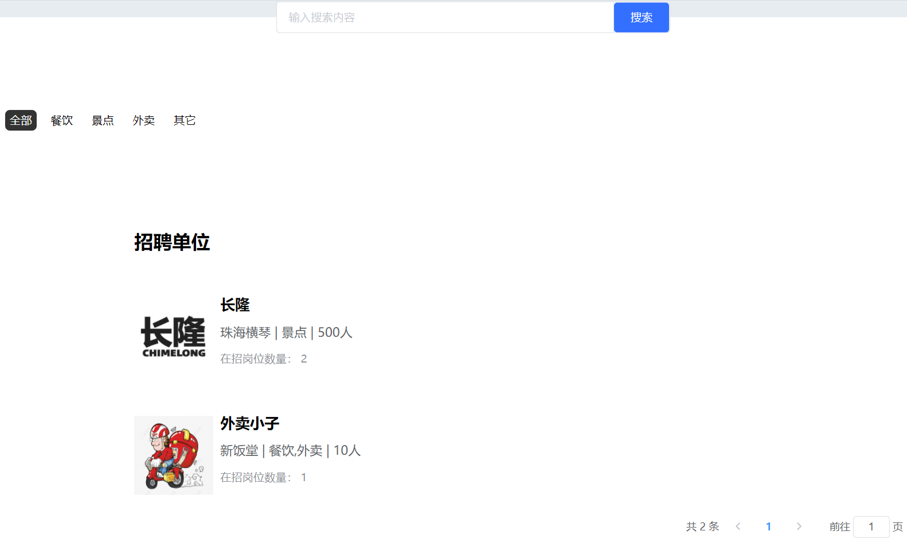
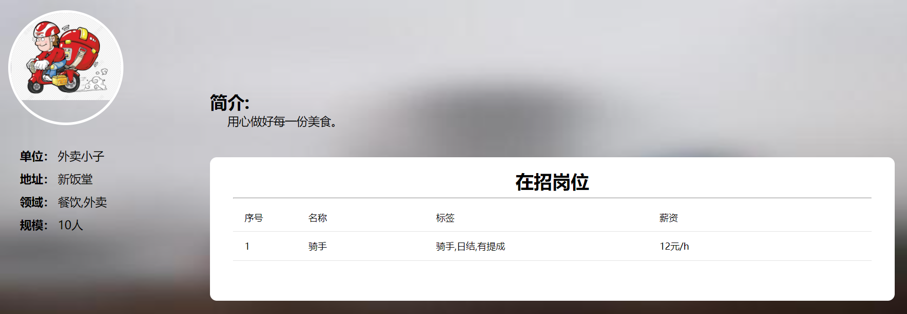
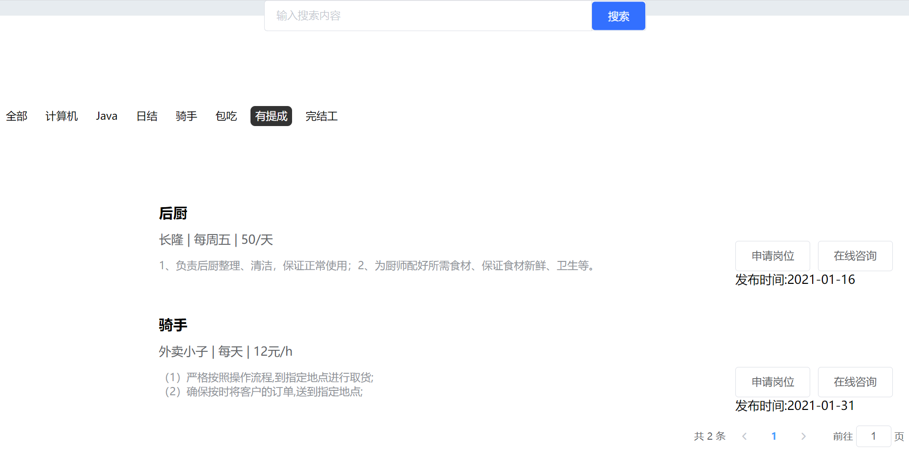
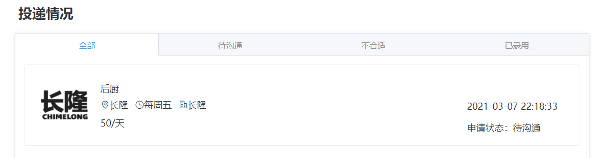
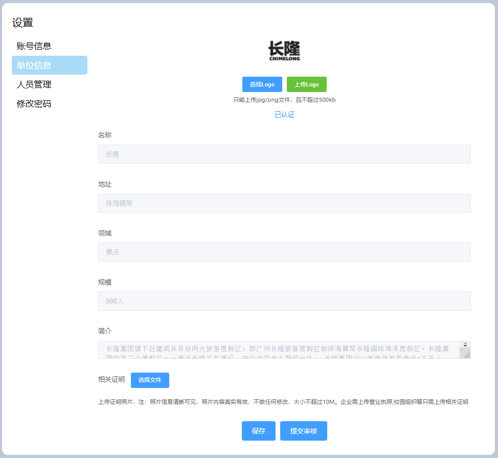
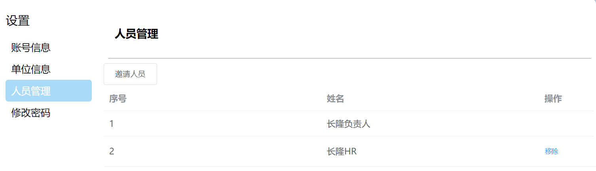
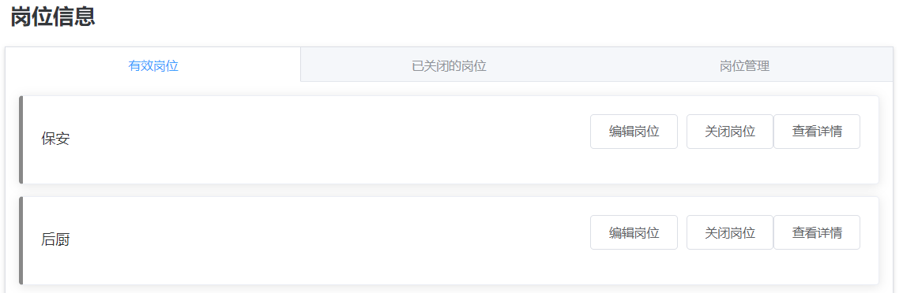
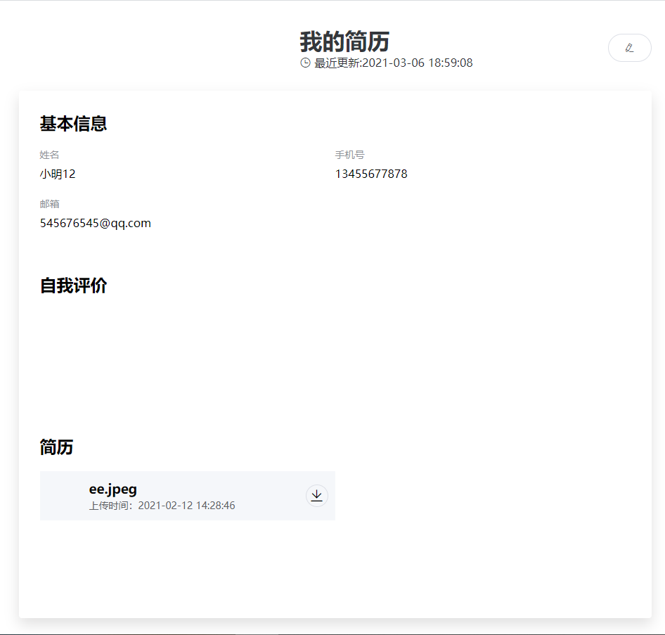

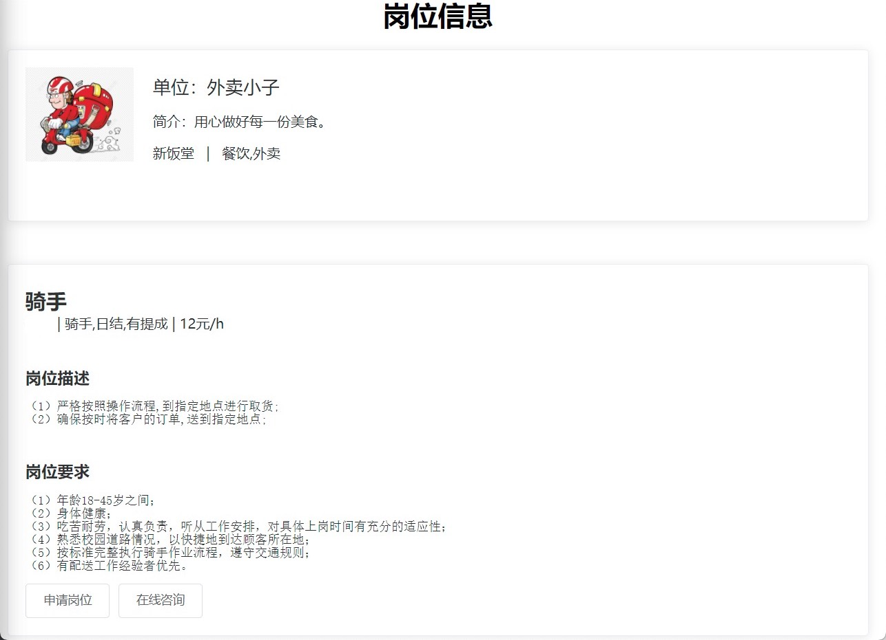
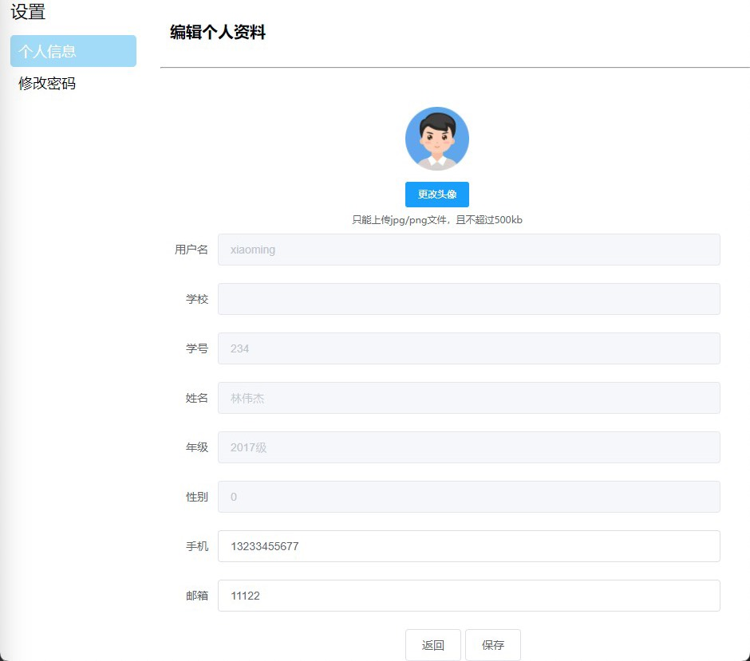

### 管理端
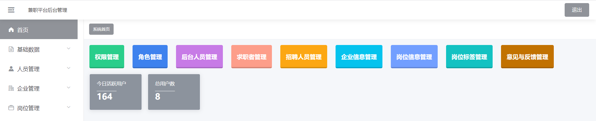
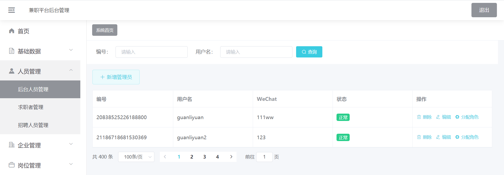
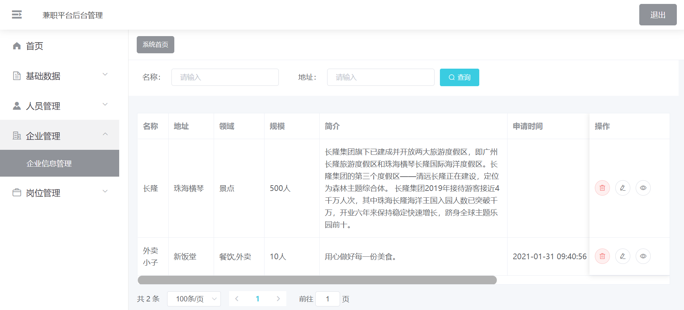
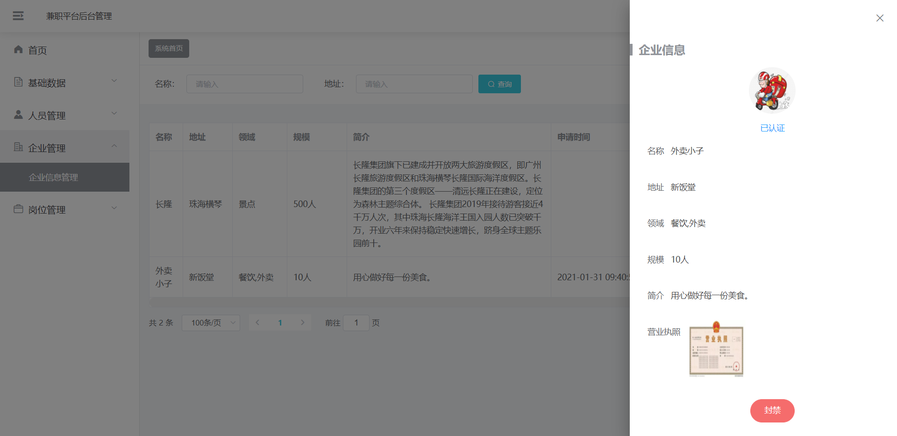
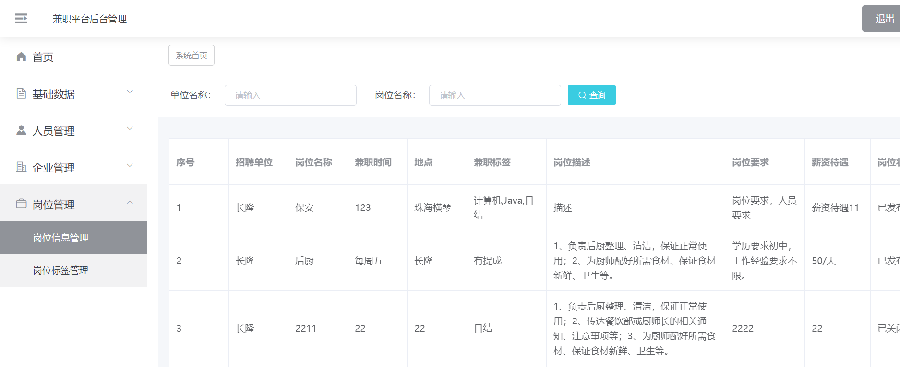
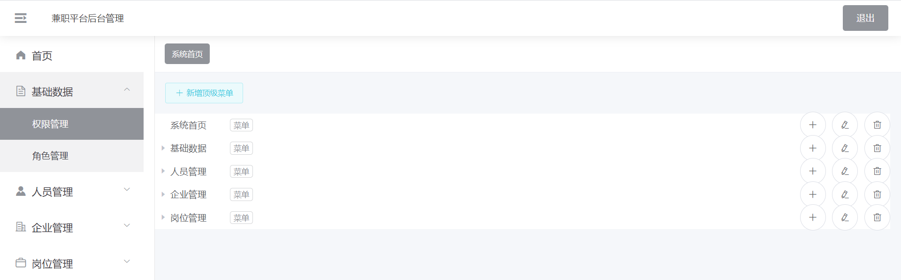

### 聊天端
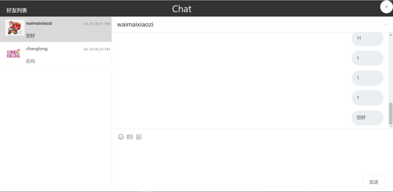